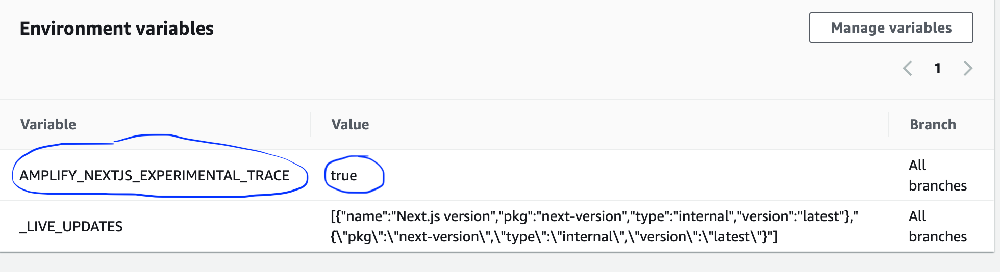

<p align="center">
  <a href="https://console.amplify.aws">
    
  </a>
</p>
<h1 align="center">
  Amplify Hosting Troubleshooting Guide
</h1>

## Table of contents

- [Builds](#builds)
  - [New commits are not triggering builds on Amplify](#new-commits-are-not-triggering-builds-on-amplify)
  - [I do not see my repo in the list](#i-do-not-see-my-repo-in-the-list)
  - [Build fails with _Cannot find module aws-exports_](#build-fails-with-cannot-find-module-aws-exports)
  - [How do I override a build timeout?](#how-do-i-override-a-build-timeout)
  - [How do I pull private packages during a build?](#how-do-i-pull-private-packages-during-a-build)
  - [How do I run Amplify functions with Python runtime?](#how-do-i-run-amplify-functions-with-python-runtime)
  - [Cache](#cache)
    - [How do I reduce the cache size?](#how-do-i-reduce-the-cache-size)
    - [How do I disable reading from cache?](#how-do-i-disable-reading-from-cache)
  - [Migration To GitHub Apps](#migration-to-github-apps)
- [Redirects](#redirects)
  - [Access denied for certain routes even with SPA redirect rule](#access-denied-for-certain-routes-even-with-spa-redirect-rule)
  - [Reverse Proxying to external API](#reverse-proxying-to-external-api)
- [Custom Domains](#custom-domains)
  - [How do I migrate domains to Amplify with minimal downtime?](#how-do-i-migrate-domains-to-amplify-with-minimal-downtime)
  - [CNAMEAlreadyExistsException](#cnamealreadyexistsexception)
- [Web previews](#web-previews)
  - [Previews are not being created for new pull requests](#previews-are-not-being-created-for-new-pull-requests)
- [SSR (Web Dynamic)](#ssr-web-dynamic)
  - [Convert an SSR App to SSG](#convert-an-ssr-app-to-ssg)
  - [Webpack ModuleNotFound Errors](#webpack-modulenotfound-errors)
  - [NotImplemented Errors](#notimplemented-errors)
  - [[ERROR] AccessDenied: Access Denied](#error-accessdenied-access-denied)
  - [Environment Variables Workaround](#environment-variables-workaround)
  - [Access Lambda Edge Logs](#access-lambda-edge-logs)
  - [SSR build fails: "target" property is no longer supported](#ssr-build-fails-target-property-is-no-longer-supported)
- [SSR (Web Compute)](#ssr-web-compute)
  - [500 error from CloudFront after migrating to Amplify Hosting Compute](#500-error-from-cloudfront-when-migrating-to-amplify-hosting-compute)
  - [Measure Compute app's initialization/start up time locally](#measure-compute-apps-initializationstart-up-time-locally)
  - [Static assets (js, css, images, and other media) returning 404s after performing a deployment](#static-assets-js-css-images-and-other-media-returning-404s-after-performing-a-deployment)
- [Manual Deployments](#manual-deployments)
  - [Deployments or jobs are stuck with a pending status in the Amplify Console](#deployments-or-jobs-are-stuck-with-a-pending-status-in-the-amplify-console)

## Builds

### New commits are not triggering builds on Amplify

If new commits on your repository are not triggering builds on Amplify, consider checking that your webhook is still present on your repository. If it is, check the history of webhook requests to see if there are any failures. We have a limit of 256 KB of payload size for incoming webhooks, so if you push a commit to your repository that has a lot of files changed, you may be hitting this limit which is the reason for builds not being triggered.

### I do not see my repo in the list

During application creation, the target repository may not show as a search result in the organization repository list if it hasn't been recently updated.

This may occur if the organization has a large number of repositories.

If this is the case, make an update to the repository and it should appear in the list.

### Build fails with _Cannot find module aws-exports_

The following error is generated when your app cannot find the `aws-exports.js` file.

```tsx
TS2307: Cannot find module 'aws-exports'
```

The `aws-exports.js` file is generated by the Amplify CLI during your backend build. Add the following code snippet to your build spec to resolve the error. This will create the `aws-exports.js` file for use in the build.

```yaml
backend:
  phases:
    build:
      commands:
        - "# Execute Amplify CLI with the helper script"
        - amplifyPush --simple
```

### How do I override a build timeout?

The default build timeout is 30 minutes. You can override the default build timeout using an environment variable: `_BUILD_TIMEOUT` (App settings > Environment variables). The minimum build timeout is 5 minutes. The maximum build timeout is 120 minutes.

### How do I pull private packages during a build?

Create your own key pair and add the private key as an environment variable in the Amplify app. Add the public key to the repository you would like to clone. You could then add the key to the ssh-agent on the build instance during build and git clone the second repository.

1. Create the keypair without a password:

```sh
ssh-keygen -f deploy_key -N ""
```

2. Encode it and copy the output into an Environment Variable in the Amplify Hosting (e.g. DEPLOY_KEY)

```sh
cat deploy_key | base64 | tr -d n
```

3. Add the contents of `deploy_key.pub` to the access keys of the private repo that you want to access

4. Then in `amplify.yml`:

```yaml
commands:
  - eval "$(ssh-agent -s)"
  - ssh-add <(echo "$DEPLOY_KEY" | base64 -d)
```

### How do I run Amplify functions with Python runtime?

[Amplify Lambda functions need Python 3.8.x or above](https://docs.amplify.aws/cli/function#supported-lambda-runtimes). Our build image supports both Python 3.7.9 which is aliased under `python3`, and Python 3.8 which is aliased under `python3.8`. In order to you use `python3` with Python 3.8 version, use the following commands (_create symlink to link python3 to python3.8 and install pipenv using pip3.8_).

```yaml
version: 1
backend:
  phases:
    build:
      commands:
        - update-alternatives --install /usr/bin/python3 python3 /usr/local/bin/python3.8 11
        - /usr/local/bin/pip3.8 install --user pipenv
        - amplifyPush --simple
```

### Cache

#### How do I reduce the cache size?

If you are using cache, you may be inadvertently caching intermediate files which aren't cleaned up between builds and bloat your cache. To omit certain folders, use the `!` directive, i.e.:

```yaml
cache:
  paths:
    - node_modules/**/*
    - "!node_modules/path/not/to/cache"
```

`node_modules/.cache` is omitted by default if you cache `node_modules`

#### How do I disable reading from cache?

Remove the cache section from your buildspec.

## Redirects

### Access denied for certain routes even with SPA redirect rule

This can also happen if your `baseDirectory` is not set correctly. For example, if your frontend is built to the `build` directory then your build settings will need to point to that or you will see this error.

For more information: https://docs.aws.amazon.com/amplify/latest/userguide/build-settings.html#yml-specification-syntax

```yaml
baseDirectory: build
files:
  - "**/*"
```

### Reverse Proxying to external API

A basic example of reverse proxying your Amplify-hosted app to a third party API can be found in the [Reverse proxy rewrite documentation](https://docs.aws.amazon.com/amplify/latest/userguide/redirects.html#reverse-proxy-rewrite). Additionally, a dynamic endpoint can be setup as follows:

```json
[
  {
    "source": "/foo/<*>",
    "target": "https://some.other.domain/resource/<*>",
    "status": "200",
    "condition": null
  }
]
```

## Custom Domains

### How do I migrate domains to Amplify with minimal downtime?

The best process to follow to minimize downtime here would be:

1. In your Amplify Hosting app, open the domain management screen
2. Type in your root domain (yourdomain.com) and click configure
3. Click “Exclude root” button
4. Click “Remove” button next to the “www” sub domain that was automatically added
5. Add a subdomain that you don't use elsewhere for testing purposes
6. Click save

What we have now done, is started the process of creating and verifying a domain in Amplify Hosting, without adding any `CNAMEs` to the Amplify Console CloudFront Distribution.

Now follow the instructions for setting up the verification `CNAME` so that your new custom domain will receive a SSL certificate.

While this process is completing, please check the TTL on the DNS records you are moving to Amplify Hosting. You want them to be as small as possible so that the change propagates quickly. If you have to change this value, please be sure to wait out at minimum, the original TTL before continuing, to make sure that your new TTL is in effect.

Once that is done and the domain is marked as available, and you've tested with the extra sub domain you created in step 5 above, you’re now ready to do the migration.

You will need to do the following in quick succession:

- Change the DNS record (the records will all have the same destination as the subdomain you created for testing in step 5 above)
- Remove the CNAME from your CloudFront distribution.
- Add the CNAME to Amplify Hosting by going to the domain management page, and clicking “Manage subdomains”
- Doing it following this method you should see very little downtime, and will mainly depend on the TTL of the DNS record.

### CNAMEAlreadyExistsException

What this means: One of the hostnames you tried to connect (could be a subdomain, or the apex) is already deployed to a Cloudfront distribution.

https://docs.aws.amazon.com/amplify/latest/userguide/custom-domains.html#cnamealreadyexistsexception-error
https://aws.amazon.com/premiumsupport/knowledge-center/resolve-cnamealreadyexists-error/

These guides are helpful for getting started with custom domains, for existing domains there are number of steps that will need to be completed (as outlined in the docs above) depending on your current hosting and DNS providers.

A CNAME alias (mydomain.com, sub.mydomain.com) can only be associated with a single CloudFront distribution at a time, if you receive this error then the domain is already associated with another CF distribution (either within the same AWS account, or potentially in a different account) and must be disassociated from the previous distribution before the distribution created for you by Amplify Hosting will work, the docs help outline how to do this (and you may need to check more than one account if you or your organization owns multiple accounts)

If you manage your domain through Route53, make sure to clean up any hosted zone CNAME or ALIAS records that point to the old distribution. After completing the above, remove the custom domain from Amplify Hosting and start the flow over.

Initial troubleshooting steps:

- Is this domain connected to a different Amplify App that you own? If so, make sure you are not trying to reuse one of the hostnames.
  - If you are using www.domain.com on the other app, you cannot use www.domain.com on this app
  - You can use other hostnames, like blog.domain.com
- If you had this domain successfully connected to Amplify and then recently (within the last hour) deleted it, please wait and try again.
- Check the Cloudfront console to see if you have this domain deployed to any distributions
  If you are positive no CloudFront distribution exists (including in other accounts) using this domain, and only if it would not be disruptive to any currently running services, try deleting and recreating the hosted zone

## Web previews

Web previews is a feature to preview changes from pull requests (PRs) before merging them to an integration branch. A web preview deploys every pull request made to your repository to a unique preview URL which is different from the URL your main site uses.

### Previews are not being created for new pull requests

Common reasons why pull requests previews may not be created:

- The Amplify app has hit the [max branches per app](https://docs.aws.amazon.com/general/latest/gr/amplify.html) quota. Consider enabling branch auto deletion in your app so that you don't accumulate branches that no longer exist in your repo.

- If you are using a public GitHub repository and your Amplify app has an IAM [service role](https://docs.aws.amazon.com/amplify/latest/userguide/how-to-service-role-amplify-console.html) associated to it, previews will not be created for security reasons. In this case, you can either disassociate the service role from your App if the app doesn't have a backend, or make the GitHub repository private.

## SSR (Web Dynamic)

**Amplify SSR Docs**: https://docs.aws.amazon.com/amplify/latest/userguide/server-side-rendering-amplify.html

With frameworks like Next.js you can create apps that are dynamic, use SSR (server side rendering), or static (SSG). If you create an SSG app and want to convert it to use SSR, you can follow our guide [here](https://docs.aws.amazon.com/amplify/latest/userguide/server-side-rendering-amplify.html#redeploy-ssg-to-ssr).

If you need to revert your app back to SSG, we suggest you delete your app and create a new one following the [guide](https://docs.aws.amazon.com/amplify/latest/userguide/server-side-rendering-amplify.html#deploy-nextjs-app) for how to get your app to be detected as SSG. **But if that is not an option and you need to revert existing app back to SSG**, please follow the guide below.

### Convert an SSR App to SSG

1. Run the following AWS CLI commands

```
aws amplify update-app --app-id <APP_ID> --platform WEB --region <REGION>
aws amplify update-branch --app-id <APP_ID> --branch-name <BRANCH_NAME> --framework 'Next.js - SSG' --region <REGION>
```

_Note, if your app uses an Amplify Backend, then set your framework field to be_ 'Next.js - SSG - Amplify'

2. Update your build spec to point the 'baseDirectory' to 'out'. e.g.

```
version: 1
frontend:
  ...
  artifacts:
    baseDirectory: out
  ...
```

3. Update the build command in your package.json to use `next export`, then commit this to trigger a new non SSR build.

4. Finally, go to the `Rewrites and redirects` tab in the Amplify Hosting, and delete the first rewrite rule that was re-writing to your SSR CloudFront Distribution.

### Webpack `ModuleNotFound` Errors

If you are facing Webpack errors (_ModuleNotFound_ / _Cannot find module_) as a result of the new Webpack 5 default.

First, you should check the troubleshooting guide provided by NextJS on this issue: https://nextjs.org/docs/messages/module-not-found. If you are still getting errors after following their guide. Your app may need to be built using the experimental-serverless-trace target. To opt-in into this behavior, you need to set the environment variable `AMPLIFY_NEXTJS_EXPERIMENTAL_TRACE=true` in your App settings.



### `NotImplemented` Errors

If you are facing the `NotImplemented` error ("_A header you provided implies functionality that is not implemented_") while using ISR, please follow the suggestion [here](#webpack-modulenotfound-errors) as a temporary workaround while we add a change to allow you to use Next.js 11 with ISR. (see: https://github.com/aws-amplify/amplify-console/issues/2179)

### [ERROR] AccessDenied: Access Denied

If you get this error when building a NextJs SSR application, it's likely that the IAM role associated to your App does not have sufficient permissions to deploy resources in your account. For SSR apps, we deploy things like an S3 bucket, a CloudFront distribution, Lambda@Edge functions, an SQS queue (if using ISR) and IAM roles. The following IAM policy is a recommended baseline of permissions that your role needs, but feel free to adjust it to your needs:

<details>
  <summary>IAM permissions for Amplify App Role</summary>
  
```
acm:DescribeCertificate
acm:ListCertificates
acm:RequestCertificate
cloudfront:CreateCloudFrontOriginAccessIdentity
cloudfront:CreateDistribution
cloudfront:CreateInvalidation
cloudfront:GetDistribution
cloudfront:GetDistributionConfig
cloudfront:ListCloudFrontOriginAccessIdentities
cloudfront:ListDistributions
cloudfront:ListDistributionsByLambdaFunction
cloudfront:ListDistributionsByWebACLId
cloudfront:ListFieldLevelEncryptionConfigs
cloudfront:ListFieldLevelEncryptionProfiles
cloudfront:ListInvalidations
cloudfront:ListPublicKeys
cloudfront:ListStreamingDistributions
cloudfront:UpdateDistribution
cloudfront:TagResource
cloudfront:UntagResource
cloudfront:ListTagsForResource
iam:AttachRolePolicy
iam:CreateRole
iam:CreateServiceLinkedRole
iam:GetRole
iam:PutRolePolicy
iam:PassRole
lambda:CreateFunction
lambda:EnableReplication
lambda:DeleteFunction
lambda:GetFunction
lambda:GetFunctionConfiguration
lambda:PublishVersion
lambda:UpdateFunctionCode
lambda:UpdateFunctionConfiguration
lambda:ListTags
lambda:TagResource
lambda:UntagResource
route53:ChangeResourceRecordSets
route53:ListHostedZonesByName
route53:ListResourceRecordSets
s3:CreateBucket
s3:GetAccelerateConfiguration
s3:GetObject
s3:ListBucket
s3:PutAccelerateConfiguration
s3:PutBucketPolicy
s3:PutObject
s3:PutBucketTagging
s3:GetBucketTagging
lambda:ListEventSourceMappings
lambda:CreateEventSourceMapping
iam:UpdateAssumeRolePolicy
iam:DeleteRolePolicy
sqs:CreateQueue           // SQS only needed if using ISR feature
sqs:DeleteQueue
sqs:GetQueueAttributes
sqs:SetQueueAttributes
amplify:GetApp
amplify:GetBranch
amplify:UpdateApp
amplify:UpdateBranch
```
</details>

### Environment Variables Workaround

Follow these steps to add environment variables for Next.js SSR/ISR apps:

1. Add your desired environment variable in the Amplify Hosting like normal ([steps](https://docs.aws.amazon.com/amplify/latest/userguide/environment-variables.html#setting-env-vars))
2. Update (or create) your `next.config.js` file with the environment variable you added in the Amplify Hosting. E.g if you created an environment variable named `MY_ENV_VAR` in the console in step 1) above, then you would add the following:

```
module.exports = {
  env: {
    MY_ENV_VAR: process.env.MY_ENV_VAR
  }
};
```

3. Now after your next build you will be able to reference your environment variable (`process.env.MY_ENV_VAR`) in your SSR lambdas!

### Access Lambda Edge Logs

Follow these steps to access logs for Lambda@Edge functions deployed with your Next.js apps:

1. Navigate to the deployment tab of your application dashboard in the Amplify console.
2. You will see IDs for the Lambda@Edge functions that have been deployed in your account. Copy the ID of the function.

```
2021-10-28T15:34:14 [INFO]: Deployed the following resources to your account:
2021-10-28T15:34:14 [INFO]: - CloudFront Domain ID: xxxxxxxxxxxxx
2021-10-28T15:34:14 [INFO]: - SSR Lambda@Edge: 123abcd-lmnop1
2021-10-28T15:34:14 [INFO]: - Image Optimization Lambda@Edge: 123abcd-qrstu2
```

3. Lambda@Edge functions are replicated globally to all edge locations and they are executed in the region closest to where the end-user requests are coming from (geographically). For example if your users are in the west coast of the United States, then it's likely that you will find the logs in either the us-west-1 or us-west-2 regions. Go to the desired region and navigate to the Lambda console. Paste the ID in the search bar to find the function.
4. Click on the function and navigate to the `Monitor` tab. Select `View Logs in CloudWatch`
5. If `Log group does not exist` error pops up, select `View existing log groups`. Search for the logs using your region and the Lambda@Edge function ID like so: `/aws/lambda/us-east-1.123abcd-lmnop1`.

### SSR build fails: "target" property is no longer supported

If you are updating your hosted Next.js 11 application to Next.js 12 or Next.js 13 then you may run into this error: `"target" property is no longer supported` when a deployment is triggered. You will need to migrate to Amplify Hosting Compute which was released in november, 2022 to support Next.js versions 12 and 13. This newly added support features:

1. Deployments that are 3x faster
2. Server-side logs delivered to Amazon CloudWatch
3. Fully managed infrastructure to reduce operational overhead

For a step-by-step guide to migrate your application to Amplify Hosting Compute, check out our [docs](https://docs.aws.amazon.com/amplify/latest/userguide/update-app-nextjs-version.html).

### Migration To GitHub Apps

As part of our new added [support for using GitHub Apps to authorize access to repositories](https://aws.amazon.com/about-aws/whats-new/2022/04/aws-amplify-hosting-github-access-workflows/), we require [single file read/write permission](https://docs.github.com/en/rest/overview/permissions-required-for-github-apps#permission-on-single-file) on the `amplify.yml` file to support creating/updating your `amplify.yml` from the AWS Amplify Console.

If you previously had our GitHub App installed for using our [PR Previews feature](https://docs.aws.amazon.com/amplify/latest/userguide/pr-previews.html), you would have received an email asking you to Accept/Reject this change to our GitHub App Permissions.

To learn more about setting up GitHub access, check out our [docs](https://docs.aws.amazon.com/amplify/latest/userguide/setting-up-GitHub-access.html)

## SSR (Web Compute)

### 500 error from CloudFront when migrating to Amplify Hosting Compute

If you migrated your Next.js app from Classic (Next.js 11 or older) to Amplify Hosting Compute (Next.js 12 or 13), you may have run into a 500 error from CloudFront. This is because the rewrite rule created previously is pointing to the CloudFront distribution that is serving the older version of the application (Next.sj 11 or older). Ideally this rewrite rule is deleted during migration but this is a bug we are tracking to fix. In the mean time, you can mitigate this behavior by manually removing the rule.

Navigate to **App Settings** -> **Rewrites and redirects** -> **Edit** -> **remove rule**.

### Measure Compute app's initialization/start up time locally

The following steps will help you determine the initialization/start up time of your Next.js 12/13 (Compute) app locally and it will enable you to do a comparison to better your app's performance locally v/s on Amplify Hosting:

1. Set the `output` option to `standalone` in the `next.config.js` file:

```
** @type {import('next').NextConfig} */
const nextConfig = {
  // Other options
  output: "standalone",
};

module.exports = nextConfig;
```

2. Build the app using the command: `next build`
3. Copy the `.next/static` folder to `.next/standalone/.next/static` with the following command:

```
cp -r .next/static .next/standalone/.next/static
```

4. Copy the `public` folder to `.next/standalone/public` with the following command:

```
cp -r public .next/standalone/public
```

5. Start the Next.js server by running the following command:

```
node .next/standalone/server.js
```

6. Note how long it takes between executing the above command and the server starting. Once the server is listening on a port, it should print the following message:

```
Listening on port 3000
```

7. Note how long it takes between step 6 and for any other modules to load once the server has started. For example, libraries like [bugsnag](https://www.npmjs.com/package/bugsnag) will take 10-12 seconds to load. Once loaded it will print a message like so: `[bugsnag] loaded`

Add the durations from Step 6 and Step 7, this will be your Compute app's initialization/start up time.

### Static assets (js, css, images, and other media) returning 404s after performing a deployment

By default, Next.js sets the `cache-control` header differently based on how your page fetches data.

If the page uses `getServerSideProps` or `getInitialProps`, the `cache-control` header from Next.js will return the following values `cache-control: s-maxage=31536000, stale-while-revalidate`. AWS Amplify's CDN Amazon CloudFront does not currently support `stale-while-revalidate`

If the page uses `getStaticProps`, the `cache-control` header from Next.js will return the following values `cache-control: public, max-age=31536000, immutable`.

Amplify does not currently support cache invalidation on deployment and instead relies on `cache-control` headers to evict old assets from cache. Once the deployment is complete, Amazon CloudFront may keep the old HTML pages in cache for 24 hours (max cache TTL) and return it to users but it may evict the assets required by the old homepage (such as JS/CSS files) from the cache.

When a user visits the website homepage, they are served with the `index.html` file from the previous deployment (cached by the CDN), which in turn tries to fetch the older assets (evicted from the CDN cache) and gets 404 errors from Amplify Hosting Compute since that asset is no longer hosted by the latest deployment.

To mitigate this, you will need to update the `cache-control` header for your HTML pages within the `customHttp.yml` file as follows:

```
customHeaders:
  - pattern: /
    headers:
      - key: Cache-Control
        value: s-maxage=10
```

## Manual Deployments

### Deployments or jobs are stuck with a pending status in the Amplify Console

Manual deploys allow you to publish your web app with Amplify Hosting without connecting a git provider. This can be achieved using the following methods:

1. Drag and drop your application folder in the Amplify Console
2. Drag and drop a zip file (that contains the build artifacts of your site) in the Amplify Console
3. Upload the zip file (that contains the build artifacts of your site) to an Amazon S3 bucket and connect the S3 bucket to an app in the Amplify Console
4. Use a public URL that points to a zip file (that contains the build artifacts of your site) in the Amplify Console

We are aware of issues with the `drag and drop` functionality when using application folders [1] for manual deployments in the Amplify Console. The deployments can fail due to a number of reasons such as:

- Transient network issues
- If the files change locally while being uploaded
- Browser session attempts to upload a large amount of static assets simulatenously

While we work on improving the reliability of our `drag and drop` uploads, we recommend our customers to use a zip file instead of dragging and dropping the application folders.

An even better approach is to upload a zip file to an Amazon S3 bucket as this avoids file uploads from the Amplify Console which should offer a higher reliability for manual deployments. Furthermore, you can automatically trigger updates to your site using the Amplify Console, S3, and AWS Lambda by referring to this [blog post](https://aws.amazon.com/blogs/mobile/deploy-files-s3-dropbox-amplify-console/).

To unblock your current deployments in `pending` state, please run the following [stop-job](https://awscli.amazonaws.com/v2/documentation/api/latest/reference/amplify/stop-job.html) CLI command using the AWS CLI for each frozen deployment:

`aws amplify stop-job --app-id {VALUE} --branch-name {VALUE} --job-id {VALUE}`

This CLI command will cancel the pending jobs and will enable you to retry a new manual deployment.
